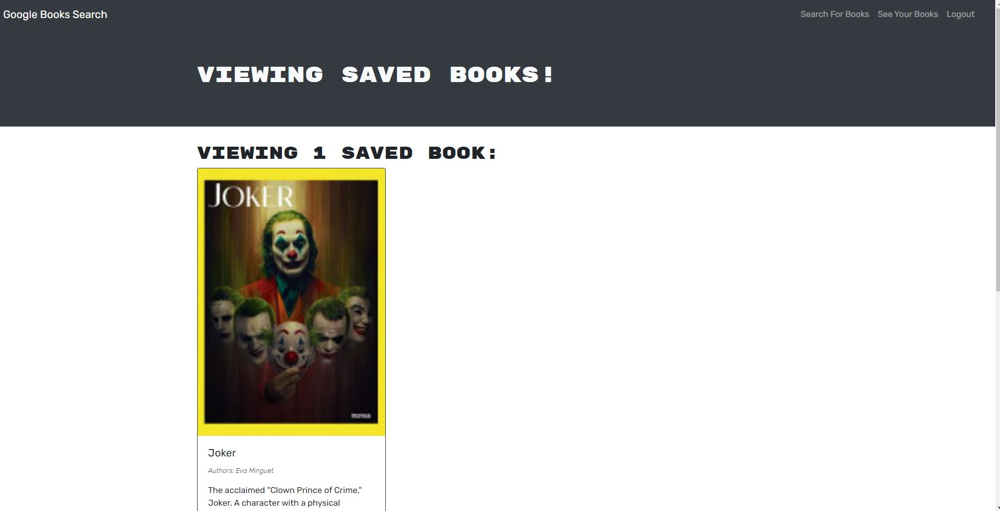

# Book-Search
A Book search application made using MERN stack

## Description
a fully functioning Google Books API search engine built with a GraphQL API and Apollo Server. The app is made using the MERN stack, with a React front end, MongoDB database, and Node.js/Express.js server and API. 

## Table of Contents
* [Installation](#installation)
* [Contribution](#contribution)
* [Features](#features)
* [Questions](#questions)
* [Screenshot](#screenshot)
* [Deployed Site](#deployed-site)

## Installation
Please download the following packages by doing `npm i` in the book-search/ directory
* "react": "^18.2.0",
* "bootstrap": "^4.4.1",
* "graphql": "^16.6.0",
* "jwt-decode": "^2.2.0",
* "react": "^16.13.1",
* "react-dom": "^16.13.1",
* "react-router-dom": "^5.1.2",
* "react-scripts": "3.4.1"
* "@apollo/client": "^3.7.1",
* "apollo-server-express": "^3.11.1",
* "bcrypt": "^5.0.0",
* "express": "^4.17.1",
* "graphql": "^15.8.0",
* "jsonwebtoken": "^8.5.1",
* "mongoose": "^5.9.10"

## Contribution
jatin1211: https://github.com/jatin1211

## Technologies used

## Questions?
Please email me with questions!
* sainijatin247@gmail.com

## Screenshot

## Deployed Site
https://gentle-plains-60700.herokuapp.com/
